# KrewsAgent

**Work done. Control kept.**

Your AI ops crew — for founders who can't hire help yet, but still can't afford to drop the ball.

> [Live app](https://krews-agent.vercel.app) · [Demo video](https://www.loom.com/share/18497e22dbf84d328277eed6368fbc87) · [Repo](https://github.com/devchicajas/KrewsAgent) · Built for the [Tetrate AI Buildathon v2.0](https://tetrate.io)

## Walkthrough

Screenshots walk through **homepage → sign up → connect → all four crews** (Ops, Growth, Support, Finance). Toggle **light** / **dark** mode from the nav (`[ LIGHT MODE ]` / `[ DARK MODE ]`).

### 1. Homepage

Land on [krews-agent.vercel.app](https://krews-agent.vercel.app). Pick **Sign up free** for real Gmail/GitHub, or **Try the demo** for a simulated inbox with no OAuth.

**Dark mode**

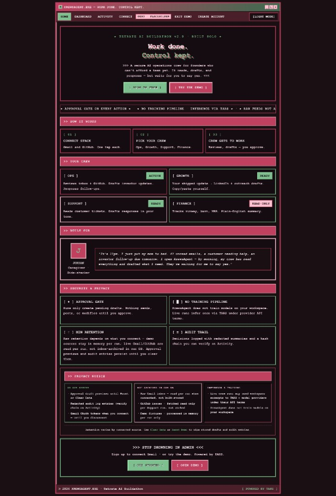

**Light mode**

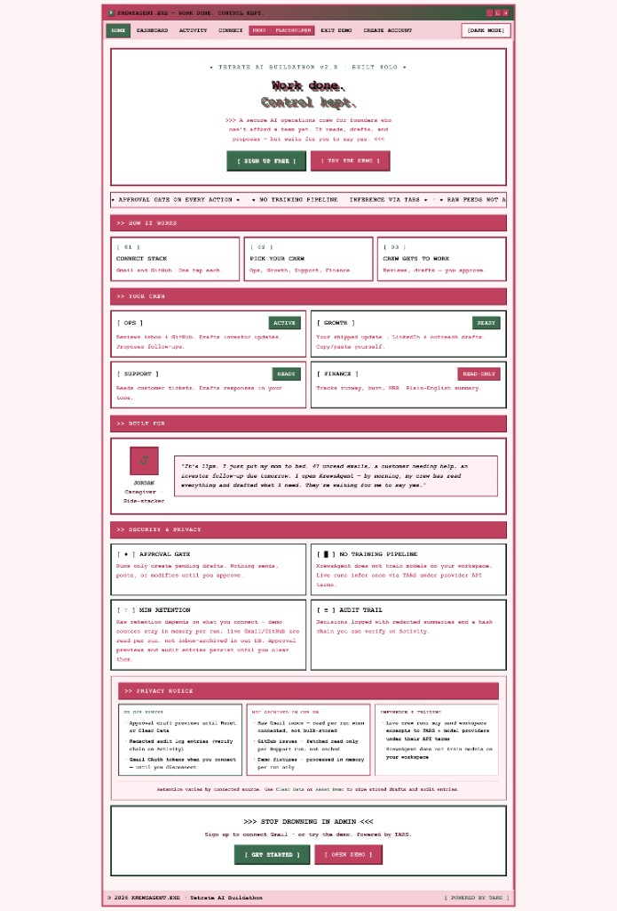

### 2. Create your account

Open **Create account** from the nav (or `/login`). Enter your name, email, and password (8+ characters). Already have an account? Switch to **Sign in**.

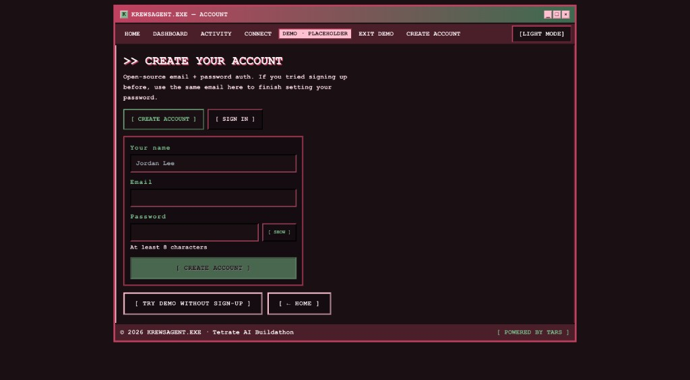

> **Demo path:** Use **Try demo without sign-up** if you only want to explore — Gmail and GitHub stay simulated until you create a real account.

### 3. Connect your stack

After sign-in, go to **Connect** (`/connect`).

1. **Gmail** — click connect; Google OAuth asks for read + compose (drafts only until you approve send).
2. **GitHub** — click connect; authorize the app, then **choose your Support repo** (where open issues are read and comments post on approve).
3. **Continue to dashboard** when both show connected (or skip GitHub if you only need Ops).

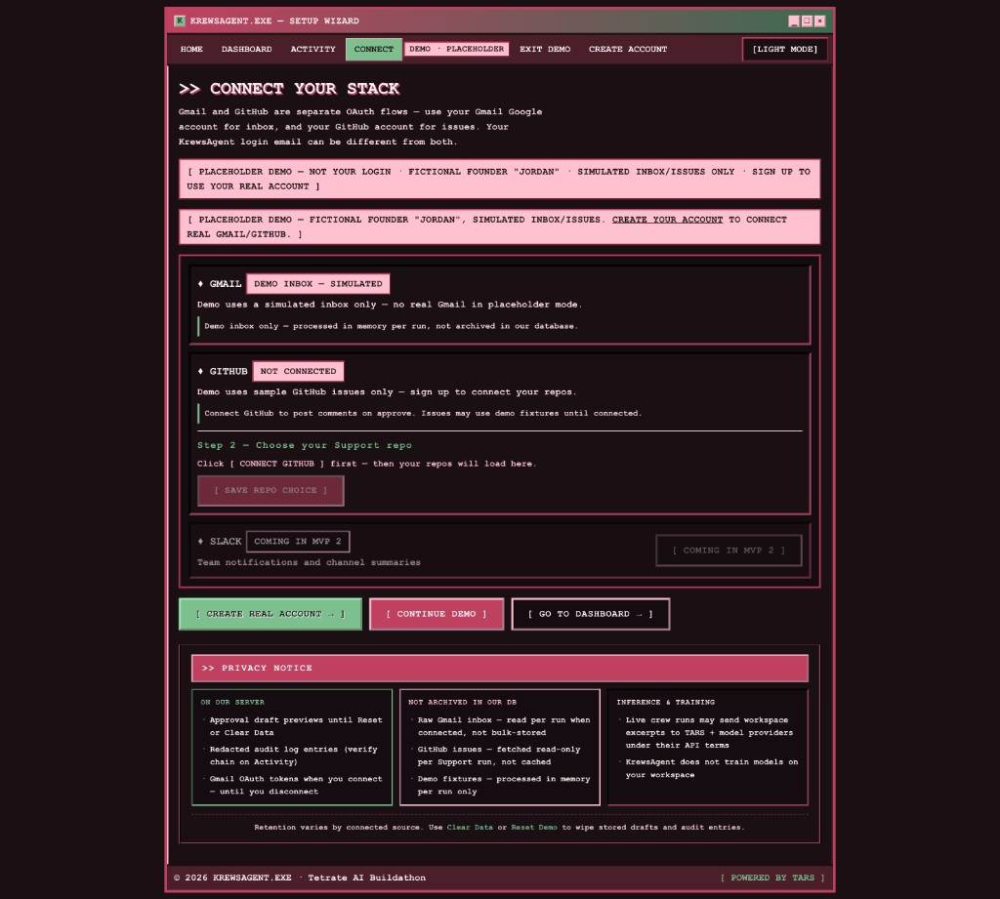

OAuth redirect URLs for self-hosting: see [Integrations setup](docs/INTEGRATIONS_SETUP.md).

### 4. Run Ops on the dashboard

Open **Dashboard** (`/dashboard`) → **Ops** is selected by default → click **Run crew**.

The pipeline runs through seven stages (context → classify → draft → approval queue → audit). When it finishes you get up to **3 approval cards** — each with **why** it was flagged, the draft preview, and your choices.

Ops email cards: `[ REJECT ]` · `[ DRAFT ]` (Gmail drafts folder) · `[ SEND ]` (double-confirm).

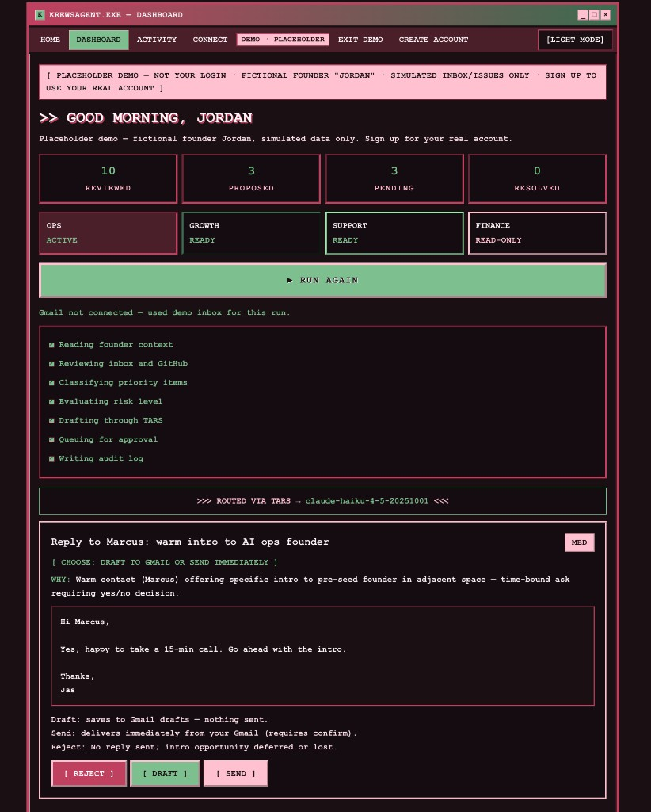

> Screenshot shows the **demo** (simulated inbox). After you connect Gmail on step 3, the banner changes and Ops reads your real inbox + spam.

### 5. Run Growth

On **Dashboard**, click **Growth**. Type what you shipped this week (or use the default), then **Run crew**.

Growth drafts a **LinkedIn post** and a **cold outreach sequence** from your update — copy/paste yourself (LinkedIn has no safe auto-post API). Cards offer `[ REJECT ]` · `[ COPY TEXT ]` · `[ SAVE DRAFT ]` (audit log only).

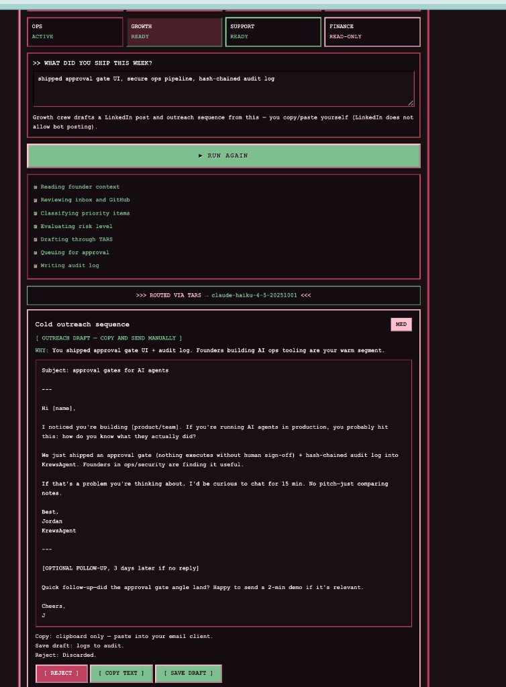

### 6. Run Support

On **Dashboard**, click **Support** → **Run crew**.

Support reads **open GitHub issues** and prior comments from your connected repo, then drafts customer replies. Each card shows **why** it was flagged and the reply preview. **`[ APPROVE ]`** posts the comment on the issue; **`[ REJECT ]`** skips it.

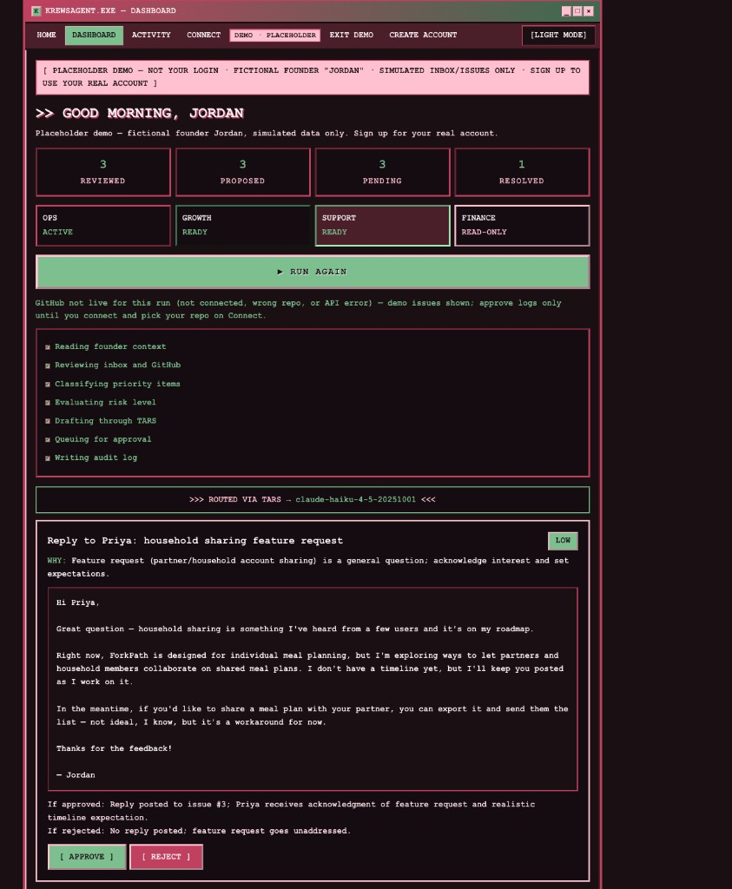

> Screenshot shows **demo/fixture issues**. Connect GitHub on step 3, pick your repo, and re-run Support for live comments on your real issues.

### 7. Run Finance (read-only)

On **Dashboard**, click **Finance** → **Run crew**.

Finance pulls **MRR, runway, and burn** from your `founder_context` row in the database — no Gmail or GitHub needed. It returns a plain-English health summary. **No approval required** — nothing executes, nothing sends.

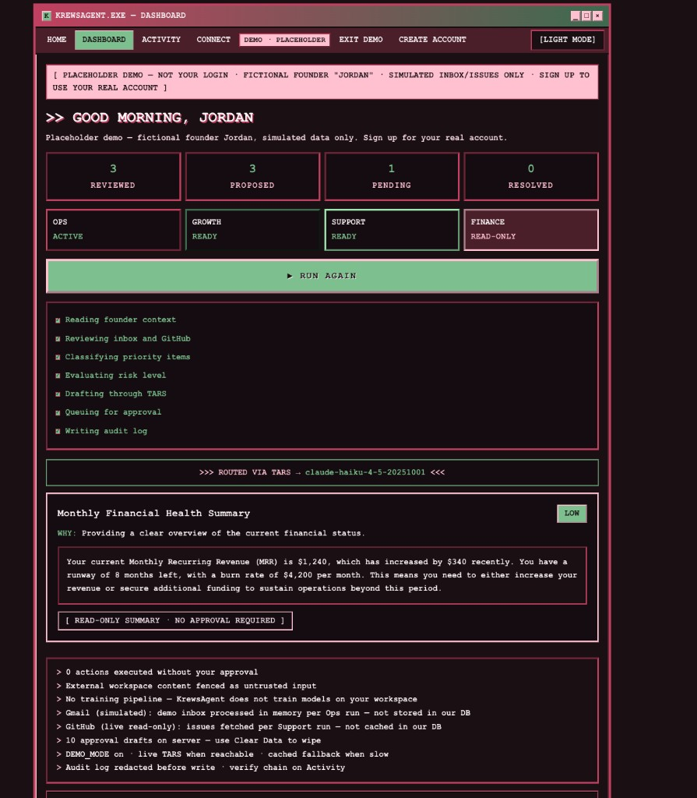

---

## Try it yourself

Two paths: **demo in ~5 minutes** (no account), or **full setup** with your real Gmail and GitHub.

### Option A — 5-minute demo (fastest)

No sign-up. Simulated inbox, sample GitHub issues, fictional founder “Jordan.”

| Step | Do this | You should see |
|------|---------|----------------|
| 1 | Open [krews-agent.vercel.app](https://krews-agent.vercel.app) | Homepage (dark or light mode) |
| 2 | Click **Try the demo** | Pink banner: “Placeholder demo” |
| 3 | Go to **Dashboard** → **Ops** → **Run crew** | 3 email approval cards; pipeline checklist completes |
| 4 | Click **Draft** or **Reject** on one card | Status updates; message under the card |
| 5 | Switch to **Growth** → edit “what I shipped” → **Run crew** | LinkedIn + outreach drafts; **Copy text** works |
| 6 | Switch to **Support** → **Run crew** | Issue reply cards; **Approve** logs only (fixture issues in demo) |
| 7 | Switch to **Finance** → **Run crew** | Read-only MRR / runway summary |
| 8 | Open **Activity** | Hash-chained audit log of runs and decisions |

Toggle **Light mode** / **Dark mode** from the nav anytime.

### Option B — Real account (~15 minutes)

Your inbox, your repo, real drafts and sends after you approve.

| Step | Do this | Notes |
|------|---------|-------|
| 1 | **Create account** at `/login` | Email + password (8+ chars) |
| 2 | **Connect** → **Gmail** | Google OAuth; scopes: read inbox + compose drafts |
| 3 | **Connect** → **GitHub** | OAuth app must list callback `https://krews-agent.vercel.app/api/integrations/github/callback` |
| 4 | **Pick your Support repo** on Connect | Required for live issue comments |
| 5 | **Dashboard → Ops → Run crew** | Green note: “live Gmail”; cards from your threads |
| 6 | **Draft** on an email card | Check Gmail **Drafts** folder |
| 7 | **Dashboard → Support → Run crew** | Green note: “live GitHub”; **Approve** posts a comment on the issue |
| 8 | **Activity** | Verify `executed:draft_email` / `executed:draft_support_reply` entries |

**OAuth troubleshooting (self-hosted):** add production redirect URIs in [Google Cloud Console](https://console.cloud.google.com/apis/credentials) and [GitHub OAuth app settings](https://github.com/settings/developers). See [Integrations setup](docs/INTEGRATIONS_SETUP.md).

### Crew cheat sheet

| Crew | Run button needs | Card actions | Side effect (only after you approve) |
|------|------------------|--------------|--------------------------------------|
| **Ops** | Gmail (or demo inbox) | Reject · Draft · Send | Gmail draft or send (threaded reply) |
| **Growth** | Your “shipped” text | Reject · Copy · Save draft | Clipboard / audit only |
| **Support** | GitHub + repo picked | Reject · Approve | GitHub issue comment |
| **Finance** | Nothing extra | — (read-only) | None |

Stats at the top: **reviewed** · **proposed** · **pending** · **resolved**.

```
Homepage  →  Sign up (or demo)  →  Connect  →  Dashboard  →  Run crew  →  Approve  →  Activity
```

---

## What is KrewsAgent?

KrewsAgent is an **AI agent with four crews** that read your real work — Gmail, GitHub, what you shipped — and draft what you should do next.

It is **not** a chatbot you babysit. It is **not** an autopilot that sends email while you sleep.

It is an **ops team that waits for your yes.**

| Without KrewsAgent | With KrewsAgent |
|------------------|-----------------|
| 47 unread emails after a long day | Ops crew reads inbox + spam, drafts replies |
| Customer issue sitting in GitHub | Support crew drafts a reply; you approve to post |
| "I should post about what I shipped" | Growth crew drafts LinkedIn + outreach; you copy/paste |
| Fear of AI sending the wrong thing | Every action is a card you approve, reject, or edit |

---

## Why we built this

A **friend** and I pitched this idea in a competition. We weren't chosen — we were eliminated. That was the end of the pitch; the idea stuck with me.

The problem is still real: founders stacking a product, a job, and life at home — **no ops team, no EA, no VA** — especially pre-seed, before Series A money, when hiring takes time and life doesn't wait.

**Caregiving** makes the hours tighter. You don't get a clean afternoon to clear inbox, reply to investors, and close support tickets. You get 11pm, tired, with work still waiting.

Most AI tools make that scarier, not easier — they want to *act* without asking.

I didn't want to leave it as slides. **I built KrewsAgent myself** — that early idea turned into something real: a working agent with Gmail, GitHub, TARS, and an approval gate you can demo today.

**KrewsAgent is the crew you can't afford to hire yet** — with one rule: *propose first, execute only when you approve.*

> *"It's 11pm. I just put my mom to bed. 47 unread emails, a customer needing help, an investor follow-up due tomorrow. I open KrewsAgent — by morning, my crew has read everything and drafted what I need. They're waiting for me to say yes."*

---

## Who it's for

- **Solo pre-seed founders** — nights and weekends, no ops team
- **Side-stackers** — product + job + family + something else
- **Caregivers** — limited hours, zero tolerance for AI gone rogue
- **Anyone between "doing it all myself" and "ready to hire"**

Not for: funded teams with dedicated ops, or people who want full autopilot.

---

## How it works (simple)

```
You connect tools  →  You pick a crew  →  AI runs  →  You get cards  →  You decide
```

1. **Connect** Gmail and/or GitHub (or use the demo with sample data).
2. **Choose a crew** — Ops, Growth, Support, or Finance.
3. **Run crew** — the agent reads your workspace and proposes up to 3 actions.
4. **Review cards** — each card is one draft with a clear approve / reject path.
5. **You act** — draft email, send email, post GitHub comment, copy LinkedIn text — only if you said yes.

Every run and every decision goes to an **audit log** you can check on the Activity page.

---

## Your four crews

| Crew | Plain English | Connect |
|------|---------------|---------|
| **Ops** | Triage email (inbox + spam + threads), warn on phishing, draft investor replies | Gmail |
| **Support** | Read GitHub issues + comment history, draft customer replies | GitHub |
| **Growth** | Turn "what I shipped" into LinkedIn + outreach drafts | Just type your update |
| **Finance** | Read-only runway / MRR summary | Nothing |

**On each card you might see:**
- **Ops:** Reject · Draft to Gmail · Send (confirm twice) · Security warnings for sketchy spam
- **Support:** Approve to post a real GitHub comment
- **Growth:** Copy text · Open LinkedIn · Save draft (no auto-post — LinkedIn blocks bots)
- **Finance:** Read-only summary — no approve button

---

## Architecture

KrewsAgent is **one agent runtime** with **four specialist crews**. Same pipeline every time — different data source and playbook per crew.

### Agent vs crew

| Term | Meaning |
|------|---------|
| **Agent** | The shared system: read your workspace → reason with AI → propose actions → wait for you |
| **Crew** | A role the agent plays: Ops, Growth, Support, or Finance (`agent_type` in code) |
| **Run** | One pipeline execution for a chosen crew — creates **pending** approval cards only |
| **Approve** | A separate step that may call Gmail, GitHub, etc. — nothing executes without this |

Ops is an **agent crew**, not a separate app. Picking OPS on the dashboard runs `agent_type: "ops"` through the same engine as Support or Growth.

### System overview

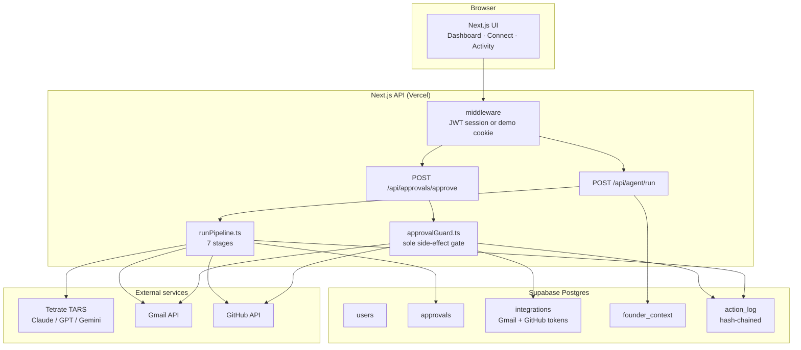

**Rule:** `POST /api/agent/run` never sends email or posts to GitHub. Only `POST /api/approvals/approve` can — via `approvalGuard.ts`.

### The agent loop

```
┌─────────────┐    ┌──────────────┐    ┌─────────────┐    ┌──────────────┐
│  Context    │ →  │  TARS (AI)   │ →  │  Approval   │ →  │  Tools       │
│  Gmail      │    │  classify +  │    │  cards      │    │  (only after │
│  GitHub     │    │  draft       │    │  (pending)  │    │   you approve)│
│  your input │    │              │    │             │    │              │
└─────────────┘    └──────────────┘    └──────────────┘    └──────────────┘
                                              │
                                              ▼
                                        Audit log (hash-chained)
```

### The 7-stage pipeline

Every crew run goes through `lib/pipeline/runPipeline.ts`:

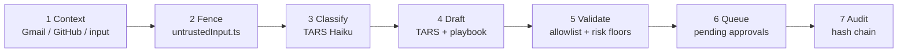

| Stage | File / module | What happens |
|-------|---------------|--------------|
| 1 Context | `runPipeline.ts`, `fetchInbox.ts`, `fetchIssues.ts` | Ops: Gmail threads + spam/tabs. Support: open issues + comments. Growth: textarea. Finance: `founder_context`. |
| 2 Fence | `lib/security/untrustedInput.ts` | `[EXTERNAL_UNTRUSTED]` blocks; injection patterns neutralized |
| 3 Classify | `tarsClient.ts` | URGENT / REPLY_NEEDED / FYI / NOISE (skipped in demo for speed) |
| 4 Draft | `lib/prompts/`, playbooks | TARS returns JSON `approval_cards` |
| 5 Validate | `outputValidation.ts`, `riskTable.ts` | Drop unknown `action_type`; floor risk levels |
| 6 Queue | `createApprovals.ts` | Max 3 cards; Ops pairs security advisory + optional reply draft |
| 7 Audit | `audit.ts` | `run_completed` entry with model + stats |

Execution is **not** in this pipeline. Only `approvalGuard.ts` creates Gmail drafts/sends or GitHub comments.

### Two-phase design

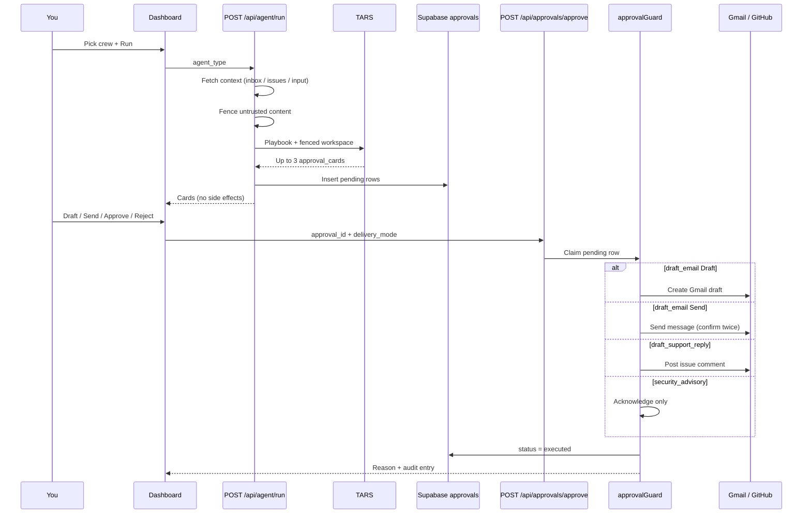

Email **Send** requires clicking **Send** twice. High-risk cards may require explicit acknowledgment.

### What each crew reads

| Crew | Context source | On approve |
|------|----------------|------------|
| **Ops** | Gmail threads (inbox + spam + promotions/updates, last 14d) | Gmail draft or send (same thread) |
| **Support** | Open GitHub issues + comment history | Post issue comment |
| **Growth** | Your “what I shipped” textarea | Save draft / copy (no auto-post) |
| **Finance** | Founder context from DB (MRR, runway) | Read-only — no execution |

### Stack

- **Frontend:** Next.js 14 (App Router), React
- **API:** Next.js route handlers + `withSecurity` (auth, rate limits, validation)
- **AI:** [Tetrate TARS](https://router.tetrate.ai) — OpenAI-compatible client, Claude via router
- **Data:** Supabase Postgres
- **Integrations:** Gmail OAuth, GitHub OAuth
- **Deploy:** Vercel

### AI (TARS)

- OpenAI-compatible client → `https://api.router.tetrate.ai/v1`
- Primary: `claude-sonnet-4-6` · classify: `claude-haiku-4-5` · fallbacks: `gpt-4o`, `gemini-2.5-flash`
- `DEMO_MODE` tries live TARS first; cached fallback uses the same approval gate if the router is slow

### Security

| Layer | What it means |
|-------|----------------|
| Approval guard | Only chokepoint for side effects |
| Untrusted fencing | Inbox/issue text treated as data, not instructions |
| Allowlist | Unknown action types dropped |
| Risk floors | Server never lowers danger level |
| Redacted audit | Hash-chained log at `/activity` |
| No training | We don't train models on your workspace |

### Privacy

- Gmail/GitHub read **per run**, not bulk-archived in our DB
- Approval previews + audit persist until you clear data
- Demo mode uses fictional data — real OAuth blocked in placeholder mode

### Allowed actions (allowlist)

TARS can only propose these `action_type` values (`lib/security/outputValidation.ts`):

| action_type | Risk cap | On approve |
|-------------|----------|------------|
| `draft_email` | high | Gmail draft or send |
| `draft_support_reply` | high | GitHub issue comment |
| `propose_meeting` | medium | Logged (calendar draft planned) |
| `draft_linkedin_post` | medium | Copy / audit |
| `draft_outreach` | medium | Copy / audit |
| `security_advisory` | low | Acknowledge only |
| `finance_summary` | low | Read-only (no approve) |

Unknown types are dropped and logged as `proposal_dropped_allowlist`.

### Data model

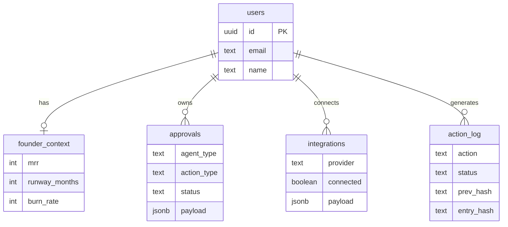

### Key API routes

| Route | Method | Purpose |
|-------|--------|---------|
| `/api/agent/run` | POST | Run pipeline for one crew; returns pending cards |
| `/api/approvals/approve` | POST | Execute side effect (draft/send/post) |
| `/api/approvals/reject` | POST | Reject with no side effects |
| `/api/integrations/gmail/start` | GET | Gmail OAuth redirect |
| `/api/integrations/github/start` | GET | GitHub OAuth redirect |
| `/api/integrations/status` | GET | Connection + repo status |
| `/api/audit/verify` | GET | Verify hash chain integrity |

### Project layout

```
app/
  dashboard/     # Crew runner + approval cards
  connect/       # Gmail / GitHub OAuth + repo picker
  activity/      # Audit log viewer
  api/
    agent/run/   # Pipeline entry
    approvals/   # Approve / reject gate
lib/
  pipeline/      # runPipeline, createApprovals
  security/      # approvalGuard, untrustedInput, audit
  gmail/         # OAuth, inbox fetch, draft/send
  github/        # OAuth, issues, post comment
  tarsClient.ts  # TARS router client
  prompts/       # Bundled playbooks (Vercel-safe)
db/
  schema.sql     # Tables + indexes
docs/screenshots/  # README walkthrough images
```

---

## For developers

```bash
git clone https://github.com/devchicajas/KrewsAgent
cd KrewsAgent
cp .env.example .env.local
npm install
# Supabase SQL: db/schema.sql then db/auth-migrations-combined.sql
npm run seed && npm run dev
```

| Command | Purpose |
|---------|---------|
| `npm run integrations:check` | Verify OAuth env |
| `npm run account:reset -- email` | Fresh start for a user |
| `npm test` | Security + helper tests |

**Docs:** [Auth](docs/AUTH_SETUP.md) · [Gmail + GitHub](docs/INTEGRATIONS_SETUP.md) · [Buildathon submission](docs/BUILDATHON_SUBMISSION.md)

**Env:** Supabase + `AUTH_SECRET` required. `TARS_API_KEY` + OAuth secrets for full experience. See `.env.example`.

**Deploy:** Vercel → env vars → set `NEXT_PUBLIC_APP_URL` → add Google/GitHub OAuth redirect URLs.

---

## MVP2 — what's next

For founders still between solo and first hire:

- [ ] **Slack / digest** — "3 cards waiting" so you don't have to remember to open the app
- [ ] **Scheduled runs** — Ops at 8am before the day starts
- [ ] **Edit on card** — tweak draft before approve
- [ ] **Founder context UI** — update MRR, runway, investor names without SQL
- [ ] **Stripe read-only** — live Finance crew data
- [ ] **First hire handoff** — export playbooks when you finally bring on a VA

LinkedIn stays copy/paste unless partner API access — bots aren't the goal; *your* voice is.

---

## License

MIT
